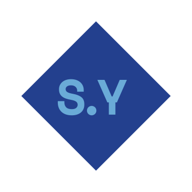

<div id="top"></div>

<!-- PROJECT SHIELDS -->
<!--
*** I'm using markdown "reference style" links for readability.
*** Reference links are enclosed in brackets [ ] instead of parentheses ( ).
*** See the bottom of this document for the declaration of the reference variables
*** for contributors-url, forks-url, etc. This is an optional, concise syntax you may use.
*** https://www.markdownguide.org/basic-syntax/#reference-style-links
-->

[![Contributors][contributors-shield]][contributors-url]
[![Forks][forks-shield]][forks-url]
[![Stargazers][stars-shield]][stars-url]
[![Issues][issues-shield]][issues-url]
[![MIT License][license-shield]][license-url]
[![LinkedIn][linkedin-shield]][linkedin-url]

<!-- PROJECT LOGO -->
<br />
<div align="center">
  <a href="https://github.com/sebasyii/personal-portfolio-website">
    
  </a>

  <h3 align="center">Sebastian&#39;s Personal Website</h3>
</div>

<!-- TABLE OF CONTENTS -->
<details>
  <summary>Table of Contents</summary>
  <ol>
    <li>
      <a href="#about-the-project">About The Project</a>
      <ul>
        <li><a href="#built-with">Built With</a></li>
      </ul>
    </li>
    <li>
      <a href="#getting-started">Getting Started</a>
      <ul>
        <li><a href="#prerequisites">Prerequisites</a></li>
        <li><a href="#installation">Installation</a></li>
      </ul>
    </li>
    <li><a href="#license">License</a></li>
    <li><a href="#contact">Contact</a></li>
    <li><a href="#acknowledgments">Acknowledgments</a></li>
  </ol>
</details>

<!-- ABOUT THE PROJECT -->

## About The Project

[![Product Name Screen Shot][product-screenshot]](https://sebastianyii.com)

This repository contains the code for my [personal portfolio website](https://sebastianyii.com).

The website is made with Next.js, Chakra UI, and Typescript. It is a place for me to share my projects, learn new things, and share my thoughts. It is also a place for me to implement things that I have learnt.

Do feel free to use it as a template if you find it useful.

<p align="right">(<a href="#top">back to top</a>)</p>

### Built With

- [Next.js](https://nextjs.org/)
- [React.js](https://reactjs.org/)
- [Chakra UI](https://chakra-ui.com/)
- [Typescript](https://typescriptlang.org/)

<p align="right">(<a href="#top">back to top</a>)</p>

<!-- GETTING STARTED -->

## Getting Started

To get a local copy up and running follow these simple example steps.

### Installation

_Here is how you get it working locally_

1. Clone the repo
   ```sh
   git clone https://github.com/sebasyii/personal-portfolio-website.git
   ```
2. Install NPM packages
   ```sh
   yarn install
   ```
3. Run the app
   ```sh
   yarn dev
   ```
   or
   ```sh
   yarn build && yarn start
   ```

<p align="right">(<a href="#top">back to top</a>)</p>

<!-- ROADMAP -->

## Roadmap

- [x] Add Changelog
- [ ] Add a 404 page
- [ ] Add jest tests
- [ ] Add Storybook

<p align="right">(<a href="#top">back to top</a>)</p>

<!-- LICENSE -->

## License

Distributed under the MIT License. See `LICENSE` for more information.

<p align="right">(<a href="#top">back to top</a>)</p>

<!-- CONTACT -->

## Contact

Project Link: [https://github.com/sebasyii/personal-portfolio-website](https://github.com/sebasyii/personal-portfolio-website)

<p align="right">(<a href="#top">back to top</a>)</p>

<!-- ACKNOWLEDGMENTS -->

## Acknowledgments

Use this space to list resources you find helpful and would like to give credit to. I've included a few of my favorites to kick things off!

- [Choose an Open Source License](https://choosealicense.com)
- [Next.js, Chakra-UI, Typescript Project Starter](https://github.com/jpedroschmitz/typescript-nextjs-starter)
- [Img Shields](https://shields.io)
- [React Icons](https://react-icons.github.io/react-icons/search)

<p align="right">(<a href="#top">back to top</a>)</p>

<!-- MARKDOWN LINKS & IMAGES -->
<!-- https://www.markdownguide.org/basic-syntax/#reference-style-links -->

[contributors-shield]: https://img.shields.io/github/contributors/sebasyii/personal-portfolio-website.svg?style=for-the-badge
[contributors-url]: https://github.com/sebasyii/personal-portfolio-website/graphs/contributors
[forks-shield]: https://img.shields.io/github/forks/sebasyii/personal-portfolio-website.svg?style=for-the-badge
[forks-url]: https://github.com/sebasyii/personal-portfolio-website/network/members
[stars-shield]: https://img.shields.io/github/stars/sebasyii/personal-portfolio-website.svg?style=for-the-badge
[stars-url]: https://github.com/sebasyii/personal-portfolio-website/stargazers
[issues-shield]: https://img.shields.io/github/issues/sebasyii/personal-portfolio-website.svg?style=for-the-badge
[issues-url]: https://github.com/sebasyii/personal-portfolio-website/issues
[license-shield]: https://img.shields.io/github/license/sebasyii/personal-portfolio-website.svg?style=for-the-badge
[license-url]: https://github.com/sebasyii/personal-portfolio-website/blob/main/LICENSE
[linkedin-shield]: https://img.shields.io/badge/-LinkedIn-black.svg?style=for-the-badge&logo=linkedin&colorB=555
[linkedin-url]: https://www.linkedin.com/in/sebastian-yii-5272841a3/
[product-screenshot]: public/projects/portfolio-thumbnail-image.png
